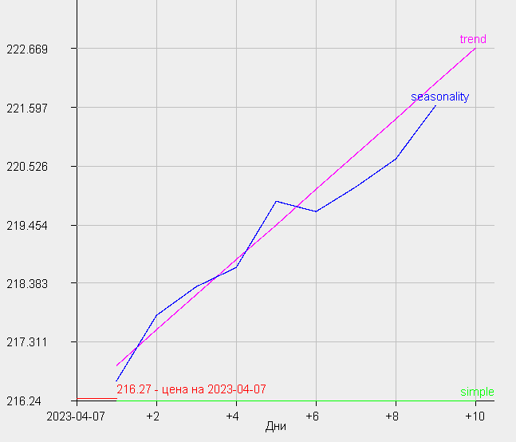

# Получение и анализ данных торгов ценных бумаг Московской Биржи (MOEX). Прогнозирование котировок ценных бумаг по историческим данным.

Проект содержит:
- подключение к Московской Бирже через API, предоставляемое Информационно-статистическим сервером Московской Биржи.
- формирует собственную базу данных в директории /data.
- позволяет добавлять текущие данные торгов.
- производит расчет пересечения двух выбранных EMA (экспоненциальная скользящая средняя).
- производит расчет прибыльности стратегии.
- прогнозирует поведение выбранной ценной бумаги.
- записывает лог событий.

Графический интерфейс выполнен с помощь библиотеки Java Swing.

## Настройки для запуска
В случае запуска jar-файла, на компьютере должна быть установлена Java не ниже 18 версии, чтобы проверить наличие ее на компьютере необходимо выполнить следующие действия:
* открыть командную строку (`cmd` в поиске в Windows)
* ввести команду `java -version`

В случае отсутствия Java на компьютере, необходимо выполнить установку с [официального сайта](https://www.java.com/ru/download/).

>>**Внимание!** Директория проекта обязательно должна содержать папку `/info` c файлом `SecuritiesList.txt`, который должен быть определенным образом структурирован:
```
Securities

Stocks:
<название акции>
<название акции>

Currencies:
<название валюты>
<название валюты>
```

## Запуск
При запуске проекта происходит чтение и парсинг файла `SecuritiesList.txt`, формируются списки акций и валют, отправляются запросы к серверу Московской Биржи для сбора информации о ценной бумаге (если в файле SecuritiesList.txt много ценных бумаг, то запуск происходит долго):
- secid (уникальный идентификатор ценной бумаги)
- shortname (короткое название ценной бумаги)
- is_traded (торгуется ли ценная бумага)
- primary_boardid (основной режим торгов)
- board_group_id (группа режимов торгов)

## Описание работы
### Таблица данных
Таблица содержит 4 столбца.
В первом столбце отображается список `secid` ценных бумаг из `SecuritiesList.txt`.
Во втором - даты последних торгов из локальной базы данных (первоначально при запуске проекта столбец пустой и заполняется при нажатии на кнопку **[Показать даты последних торгов в БД]**).
В третьем и четвертом столбцах - дата текущих торгов и цена бумаги (первоначально при запуске проекта эти столбцы пустые и заполняются при нажатии на кнопку **[Внести значение]**).

### Кнопка [Обновить список ценных бумаг]
В проекте есть возможность во время работы программы добавлять интересующие ценные бумаги, для этого необходимо в файле `SecuritiesList.txt` добавить или удалить названия требуемых ценных бумаг, а затем нажать кнопку **[Обновить список ценных бумаг]**. Программа заново пропарсит файл `SecuritiesList.txt`, создаст списки акций и валют, выполнит запросы к серверу Московской Биржи, сформирует необходимую информацию по ценным бумагам и отобразит их в первом столбце таблицы данных. Причем, если во втором, третьем и четвертом столбцах содержались данные, то и после нажатия кнопки **[Обновить список ценных бумаг]** эта информация сохранится и отобразится в таблице данных.

### Кнопка [Обновить БД]
При нажатии на эту кнопку происходит парсинг локальной базы данных (а в случае ее отсутствия, она создается), расположенной в директории проекта в папке `/data` (если этой директории нет, то программа создаст ее сама), создаются запросы к серверу Московской Биржи по списку ценных бумаг из первого столбца таблицы данных. Затем происходит сравнение последней даты торгов по конкретной ценной бумаге в локальной базе данных и на сервере Московской Биржи, и в случае их различия программа заново загружает историю торгов по данной ценной бумаге.

### Кнопка [Показать даты последних торгов в БД]
При нажатии на эту кнопку происходит парсинг локальной базы данных, получение дат последних торгов по каждой ценной бумаге из первого столбца таблицы данных, отображение полученных дат во втором столбце таблицы данных. В случае отсутствия информации в локальной базе данных по какой-нибудь ценной бумаге, во втором столбце таблицы данных будет отображено `Нет данных в БД`.

### Кнопка [Удалить БД и загрузить заново]
При нажатии на эту кнопку происходит удаление всех файлов в директории `/data` и создается новая локальная база данных по всему списку ценных бумаг из первого столбца таблицы данных. Создание новой локальной базы данных происходит путем множественных запросов к серверу Московской Биржи и получение от него истории торгов по заданным ценным бумагам. Запись истории торгов ценной бумаги происходит в файл `<SECID>.txt`. Воспользоваться данной кнопкой целесообразно в следующих случаях:
 - вручную вносились изменения в локальную базу данных (если даты последних торгов ценной бумаги в локальной базе данных и на сервере Московской Биржи совпадают, то кнопка **[Обновить БД]** ничего не сделает, даже если данные (кроме даты последних торгов) в локальной базе данных и на сервере Московской Биржи отличаются).
 - из файла `SecuritiesList.txt` удалялись ценные бумаги и необходимо почистить локальную базу данных от лишних файлов неиспользуемых ценных бумаг.

### Блок [Добавление данных торгов]
Данный блок представлен тремя текстовыми полями `SecID`, `Дата`, `Цена` и кнопка **[Внести значение]**. Поскольку сервер Московской Биржи дает информацию о текущих торгах по платной подписке, то использование данного блока позволяет вручную вносить данные (как текущие, так и прошлые) в историю торгов ценной бумаги.

В текстовое поле `SecID` вносится `secid` ценной бумаги (регистр букв не имеет значения, `secid` можно копировать из первого столбца таблицы данных комбинацией клавиш `Ctrl + C` для Windows).

В текстовое поле `Дата` вносится дата (по умолчанию там отображается текущая дата). Формат внесения даты: `dd.MM.yyyy`, `dd,MM,yyyy`, `dd/MM/yyyy`, `dd-MM-yyyy`, `yyyy.MM.dd`, `yyyy,MM,dd`, `yyyy/MM/dd`, `yyyy-MM-dd`.

В текстовое поле `Цена` вносится цена ценной бумаги. При внесении цены допускается использования десятичных разделителей: точки `.` и запятой `,`.

При нажатии на кнопку **[Внести значение]** происходит проверка внесенных значений:
- `secid` проверяется на наличие его в первом столбце таблицы данных.
- дата проверяется на соответствие формату внесения данных и наличие такой даты в календаре.
- цена проверяется на соответствие формату внесения данных.


В случае успешного прохождения всех проверок, внесенные данные отображаются в третьем и четвертом столбцах таблицы данных для выбранной ценной бумаги, и будут учитываться при проведении расчетов по этой ценной бумаге. Текстовые поля `SecID`, `Дата`, `Цена` очищаются, а в поле `Дата` подставляется текущая дата.

В случае неуспешного прохождения проверок, текстовые поля `SecID`, `Дата`, `Цена` остаются заполненными внесенными данными.

### Блок [Расчет стратегии]
Данный блок содержит шесть текстовых полей `SecID`, `Начальная дата`, `Конечная дата`, `Первый EMA`, `Второй EMA`, `Налог` и кнопки **[Рассчитать EMA на текущий день]**, **[Рассчитать прибыль]**.

В текстовое поле `SecID` вносится `secid` ценной бумаги (формат внесения данных и их проверка аналогична блоку **[Добавление данных торгов]**).

В текстовые поля `Начальная дата` и `Конечная дата` вносятся даты, с которой и по которую необходимо выполнять расчет (формат внесения данных и их проверка аналогична блоку **[Добавление данных торгов]**).

В текстовые поля `Первый EMA` и `Второй EMA` вносятся целые числа больше 0. Эти значения используются в формуле для вычисления коэффициента экспоненциальной скользящей средней (коэффициент альфа = 2 / (Первый EMA + 1) и коэффициент альфа = 2 / (Второй EMA + 1)). Коэффициент альфа - коэффициент позволяющий в большей или меньшей степени учитывать предыдущие значения торгов ценной бумагой при расчете текущего значения EMA, т.е. чем большее значение введено в текстовое поле, тем меньше значение коэффициента альфа, тем меньше предыдущие значения торгов влияют на расчет текущего значения EMA.

Ниже представлен пример, как выглядят графики с EMA равным 10 и 200, видно, что при EMA 200, график EMA сильно отстает от фактических значений торгов.


В текстовом поле `Налог` вносится размер налога на прибыль, который необходимо заложить в расчет прибыли. При внесении данных допускается использования десятичных разделителей: точки `.` и запятой `,`, а также формат ввода в виде процентов или значения от 0 до 1 (например: 0,13 и 13).

При нажатии на кнопку **[Рассчитать прибыль]** происходит проверка внесенных значений (необходимо заполнение всех 6 текстовых полей):
- `secid` проверяется на наличие его в первом столбце таблицы данных.
- даты проверяется на соответствие формату внесения данных и наличие таких дат в календаре.
- EMA проверяются на соответствие формату внесения данных.
- налог проверяется на соответствие формату внесения данных.

В случае неуспешного прохождения проверок, текстовые поля остаются заполненными внесенными данными.

В случае успешного прохождения всех проверок, происходит расчет прибыльности при нижеописанной стратегии покупки и продажи ценной бумаги.

Суть стратегии торговли заключается в:
- покупка ценной бумаги на следующий день, когда размер меньшей EMA < размера большей EMA и меньшая EMA пересекает большую EMA (т.е. когда ценная бумага показывает **рост**).
- продажа ценной бумаги на следующий день, когда размер меньшей EMA > размера большей EMA и меньшая EMA пересекает большую EMA (т.е. когда ценная бумага показывает **падение**).

Пример реализации стратегии ниже:


При нажатии на кнопку **[Рассчитать EMA на текущий день]** происходит проверка внесенных значений (необходимо заполнение полей `SecID`, `Первый EMA`, `Второй EMA`, данные в остальных полях не применяются в расчете):
- `secid` проверяется на наличие его в первом столбце таблицы данных.
- EMA проверяются на соответствие формату внесения данных.

В случае неуспешного прохождения проверок, текстовые поля остаются заполненными внесенными данными.

В случае успешного прохождения всех проверок, происходит расчет значений введенных EMA на последнюю дату, найденную в локальной базе данных для данной ценной бумаги.

### Текстовый блок
В данном блоке отображаются все действия программы, а также выводятся результаты расчетов.

По завершению работы программы данные из текстового блока сохраняются в файл `Log.txt` в директории `/info` (в случае отсутствия данного файла в указанной директории, он создастся автоматически).

### Блок [Прогнозирование]
Данный блок перенаправляет в новое окно, где уже и производится расчет прогноза по выбранной ценной бумаге.

Блок содержит текстовое поле `SecID` и кнопку **[Прогнозирование]**. 
В текстовое поле `SecID` вносится `secid` ценной бумаги (формат внесения данных и их проверка аналогична блокам **[Добавление данных торгов]** и **[Расчет стратегии]**).

При нажатии на кнопку **[Прогнозирование]** происходит проверка внесенных значений:
- `secid` проверяется на наличие его в первом столбце таблицы данных.

В случае неуспешного прохождения проверок, текстовые поля остаются заполненными внесенными данными.

В случае успешного прохождения всех проверок, происходит открытие нового окна, старое окно становится пустым, данные из текстового блока переносятся в текстовый блок нового окна.

Новое окно закрывается при нажатии кнопки **[Назад]**, при нажатии кнопки **[Х]** никаких действий не происходит. Также при нажатии кнопки **[Назад]** происходит:
- новое окно закрывается.
- данные в основном окне становятся видимыми.
- данные из текстового блока нового окна переносятся в текстовый блок основного окна.

#### Текстовое поле `Начальная дата` в новом окне
В текстовое поле `Начальная дата` вносится дата, с которой необходимо выполнять расчет (формат внесения данных и их проверка аналогична блоку **[Добавление данных торгов]** и блоку **[Расчет стратегии]**).

#### Текстовое поле `Конечная дата` в новом окне
В текстовое поле `Конечная дата` вносится дата, до которой необходимо выполнять расчет (формат внесения данных и их проверка аналогична блоку **[Добавление данных торгов]** и блоку **[Расчет стратегии]**).

#### Кнопка [Составить прогноз] в новом окне
При нажатии на данную кнопку происходит проверка внесенных дат на соответствие формату внесенных данных и наличие таких дат в календаре.

В случае неуспешного прохождения проверок, текстовые поля остаются заполненными внесенными данными.

В случае успешного прохождения всех проверок, происходит расчет простого экспоненциального сглаживания, в котором константа сглаживания (альфа) определяется методом градиентного спуска путем минимизации суммы квадратов отклонений (в блоке **[Расчет стратегии]** коэффициент альфа вычислялся по формуле, которую используют в трейдинге, а не получают в результате оптимизации). В результате вычислений получаем последнее значение EMA, которое и является прогнозируемым значением на все последующие дни.

Затем происходит проверка на наличие тренда критерием Стьюдента и в случае наличия тренда происходит расчет экспоненциального сглаживания Холта с корректировкой тренда. В данном варианте присутствуют две константы сглаживания (альфа и гамма), которые также определяется методом градиентного спуска путем минимизации суммы квадратов отклонений. В результате вычислений получаем прогнозируемые значения на 10 дней вперед.

Далее происходит проверка на наличие сезонности путем вычисления автокорреляций и в случае наличия сезонности происходит расчет мультипликативного экспоненциального сглаживания Хотла-Винтерса. В данном варианте присутствуют три коэффициента (альфа, гамма и дельта), которые также определяется методом градиентного спуска путем минимизации суммы квадратов отклонений. Для получившегося мультипликативного экспоненциального сглаживания вычисляются автокорреляции и, если новые автокорреляции меньше первоначально полученных, получаем прогнозируемые значения на 10 дней вперед (или на меньшее количество дней, если интервал сезонности меньше 10 дней).

Полученные результаты прогнозов тремя методами отображаются в виде графиков (если график прогноза с использованием экспоненциального сглаживания с корректировкой тренда отсутствует, значит тренд отсутствует; если график прогноза с использованием мультипликативного экспоненциального сглаживания отсутствует, значит отсутствует сезонность или размер автокорреляций после применения метода не уменьшился).

Пример полученных графиков ниже:



По горизонтальной оси отложены дни будущего, на которые выполнено прогнозирование. По вертикальной оси отложена цена ценной бумаги.
Красный график - цена ценной бумаги на дату из текстового поля `Конечная дата` в новом окне или ближайшую к ней, если нужная дата отсутствует в локальной базе данных. Зеленый график - прогнозируемая цена ценной бумаги методом простого экспоненциального сглаживания. Фиолетовый график - прогнозируемая цена ценной бумаги методом экспоненциального сглаживания с корректировкой тренда. Синий график - прогнозируемая цена бумаги методом мультипликативного экспоненциального сглаживания.

После получения графиков можно изменить значения в текстовых полях `Начальная дата` и `Конечная дата` в новом окне и после нажатия кнопки **[Составить прогноз]** получить новые графики.

Чтобы изменить ценную бумагу для составления прогноза необходимо вернуться в основное окно, нажав кнопку **[Назад]** в новом окне, в основном окне ввести необходимый `secid` и нажать кнопку **[Прогнозирование]**.

## Завершение работы
Программа завершает работу при нажатии в основном окне на кнопку **[Х]**.
